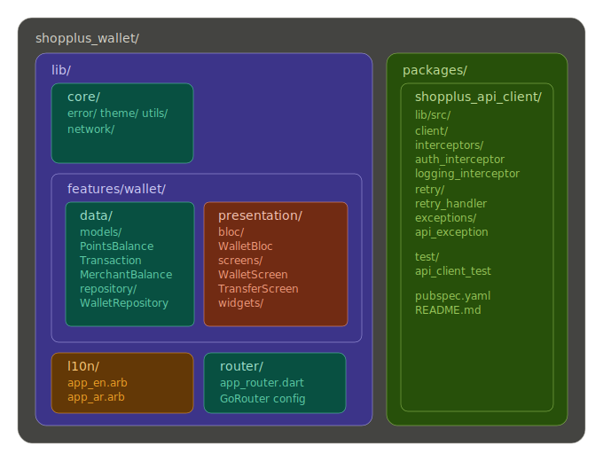

# ShopPlus Wallet — Loynova Flutter Assessment

---

## Getting Started

```bash
cd shopplus_wallet
flutter pub get

# web
flutter run -d chrome

# android
flutter run -d android

# ios
flutter run -d ios
```

**Requirements:** Flutter `>=3.38.0`, Dart `>=3.0.0`

### Tests

```bash
# app tests
flutter test

# with coverage
flutter test --coverage

# api client package tests
cd packages/shopplus_api_client && dart test
```

---

## Project Structure

I went with a feature-based structure. Everything related to the wallet feature lives together — models, repository, BLoC, screens, widgets. Makes it easier to navigate when you're focused on one feature without jumping between a `data/` folder and a `presentation/` folder constantly.

```
shopplus_wallet/
├── lib/
│   ├── core/
│   │   ├── error/              # WalletException
│   │   ├── network/            # ApiClient provider (wired from package)
│   │   ├── theme/              # AppColors, ThemeData
│   │   └── utils/              # formatters
│   │
│   ├── features/
│   │   └── wallet/
│   │       ├── data/
│   │       │   ├── models/     # PointsBalance, Transaction, etc.
│   │       │   └── repository/ # WalletRepository (abstract) + MockWalletRepository
│   │       └── presentation/
│   │           ├── bloc/       # WalletBloc, events, states
│   │           ├── screens/    # WalletScreen, TransferScreen
│   │           └── widgets/    # BalanceCard, TransactionItem, FilterChips, etc.
│   │
│   ├── l10n/
│   │   ├── app_en.arb
│   │   └── app_ar.arb
│   │
│   ├── router/
│   │   └── app_router.dart
│   └── main.dart
│
└── packages/
    └── shopplus_api_client/    # standalone reusable package
        ├── lib/src/
        │   ├── client/
        │   ├── interceptors/   # auth + logging
        │   ├── retry/          # exponential backoff
        │   └── exceptions/
        └── test/
```

---

## Architecture Decisions

### State Management — BLoC

Went with `flutter_bloc`. For a financial feature with multiple states (loading, loaded, filtering, paginating, transferring) BLoC keeps things explicit and easy to test. Every user action is a named event, every possible screen state is a named state — nothing implicit.

One thing I was careful about with `FilterTransactions`: the `WalletLoaded` state keeps `allTransactions` and `filteredTransactions` as separate fields. Filtering always runs against `allTransactions`, never against the already-filtered list. This way switching back to "All" works without a network call.

### State Flow

```
open app
    ↓
LoadWallet
    ↓
WalletLoading  →  shimmer shown
    ↓
Future.wait([getBalance(), getTransactions()])  ← parallel, saves ~800ms
    ↓
WalletLoaded                WalletError → retry button
    ↓
user taps filter chip
    ↓
FilterTransactions(type)
    ↓
filter allTransactions (original preserved)
    ↓
WalletLoaded (filteredTransactions updated, allTransactions unchanged)
    ↓
user scrolls to bottom
    ↓
LoadMoreTransactions → fetch next page, append to allTransactions
```

### Error Handling

Three layers, each handles what it owns:

- **Repository** — throws `WalletException(code, message)` for known errors, lets unknown ones bubble up
- **BLoC** — wraps everything in try/catch, maps to `WalletError` or `TransferError` states
- **UI** — reacts based on error code: field-level inline errors for `INSUFFICIENT_BALANCE` and `RECIPIENT_NOT_FOUND`, full-screen error + retry for load failures, SnackBar for anything else

---

## Mock Data

No live API, so `MockWalletRepository` simulates delays that mirror real network latency:

```dart
getBalance()      → 800ms
getTransactions() → 600ms
transferPoints()  → 1000ms
```

I added the delays intentionally — without them you'd never actually see the shimmer or the disabled submit button during transfer. Also surfaces any race conditions early.

Error cases:
- `points > 15750` → `WalletException('INSUFFICIENT_BALANCE', ...)`
- `recipient == 'notfound@test.com'` → `WalletException('RECIPIENT_NOT_FOUND', ...)`

Swapping in a real `HttpWalletRepository` later won't touch the BLoC or UI at all — the abstract `WalletRepository` interface handles that.

---

## Sensitive Data Handling (Transfer Screen)

- `enableSuggestions: false` + `autocorrect: false` on the recipient field — no keyboard autocomplete on financial recipient data
- No `print` or `debugPrint` anywhere in the transfer flow
- Confirmation bottom sheet before submitting — shows recipient + points so the user sees exactly what they're about to send
- Recipient input is trimmed and normalized before it hits the repository
- Errors from the repo surface as typed `WalletException` codes, not raw messages

---

## Trade-offs

**No domain layer (Use Cases)** — the scope here is two screens. Adding a full domain layer would be more structure than the feature needs. The repository interface already gives you the abstraction boundary. In a larger app with real business logic I'd add them.

**Client-side filtering** — works fine with the mock data volume. In production with a real API and potentially thousands of transactions, this should move server-side as query params on `getTransactions()`.

**Single BLoC for both screens** — balance updates after a transfer need to reflect on the wallet screen. One BLoC is simpler than managing cross-BLoC communication for this case.

**Balance via GoRouter extras** — passing the balance to the transfer screen via route extras avoids a redundant API call just to know the max transferable amount.

---

## Optional: Localization

Added full EN/AR support using Flutter's built-in `flutter_localizations`. ARB files are under `lib/l10n/`. RTL layout is handled automatically by Flutter when locale switches to `ar`. There's a language toggle in the AppBar that switches at runtime — no app restart needed. Zero hardcoded strings in the UI.

---

## Optional: API Client Package

Located at `packages/shopplus_api_client/`. Standalone Dart package, path-referenced from the main app.

What it does:
- **Auth interceptor** — injects `Authorization: Bearer {token}` via a `tokenProvider` callback, so the token source is configurable
- **Logging interceptor** — logs request/response using `dart:developer` (not `print`), masks the auth header value in logs
- **Retry with exponential backoff** — retries on network errors and 5xx responses, up to 3 attempts, with 500ms → 1s → 2s delays. Doesn't retry on 4xx.
- **Typed exceptions** — `ApiException.network()`, `.timeout()`, `.server()`, `.unauthorized()`

```dart
final client = ApiClient(
  baseUrl: 'https://api.shopplus.com',
  tokenProvider: () async => await secureStorage.read('auth_token'),
  enableLogging: kDebugMode,
);

final response = await client.get('/wallet/balance');
```

The `MockWalletRepository` is still used for this assessment since there's no live API. The `ApiClient` is wired in `core/network/api_client_provider.dart` and ready to back a real repository implementation.

---

## Diagrams

Visual references for the architecture and runtime behavior. Sources live under `docs/`.

### Project Structure

High-level map of the feature-based layout — `core/`, `features/wallet/`, the l10n folder, the router, and the standalone `packages/shopplus_api_client/` package.



### State Flow

End-to-end BLoC state transitions: initial load → loaded → filter → paginate → transfer → balance refresh, including the error and retry paths.

